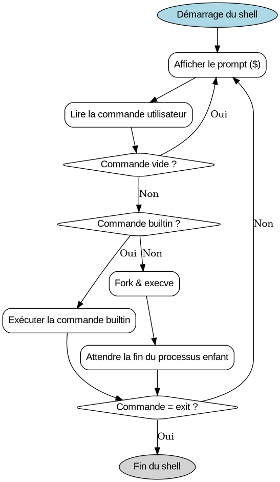

# holberton-simple_shell

## Description

**simple_shell** est une implémentation simplifiée d'un shell Unix. Ce projet vise à comprendre le fonctionnement d'un shell, la gestion des processus, l'exécution de commandes et la manipulation des variables d'environnement.

## Fonctionnalités
- Exécution de commandes système (ex : `ls`, `pwd`, `echo`, etc.)
- Gestion des arguments pour les commandes
- Recherche des exécutables dans le PATH
- Gestion des erreurs d'exécution
- Gestion des signaux (ex : Ctrl+C)
- Commandes intégrées (builtins) : `exit`, `env`
- Mode interactif et mode batch (lecture depuis un fichier ou un pipe)

## Compilation

Pour compiler le shell, utilisez :
```sh
gcc -Wall -Werror -Wextra -pedantic *.c -o simple_shell
```

## Flowchart



## Utilisation

### Mode interactif
```sh
$ ./simple_shell
$ ls -l /tmp
$ echo "Hello, world!"
$ env
$ exit
```

### Mode batch
```sh
$ echo -e "ls\npwd" | ./simple_shell
```

## Commandes intégrées
- `exit` : Quitte le shell
- `env` : Affiche les variables d'environnement

## Organisation du projet
- `shell.c` : Boucle principale du shell
- `exec_command.c` : Exécution des commandes
- `shell.h` : Fichier d'en-tête principal
- `test_shell.sh` : Script de test

## Exemple de fonctionnement
```sh
$ ./simple_shell
$ ls
exec_command.c  shell.c  shell.h  test_shell.sh
$ env
PATH=/usr/local/bin:/usr/bin:/bin
...
$ exit
```

## Auteurs
- Clément Gibot
- Arnaud Tilawat

## Licence
Copyright (c) 2025 Clément Gibot et Arnaud Tilawat. Tous droits réservés.

## Documentation
Pour plus d'informations, consultez la page de manuel :
```sh
man ./man_1_simple_shell
```
