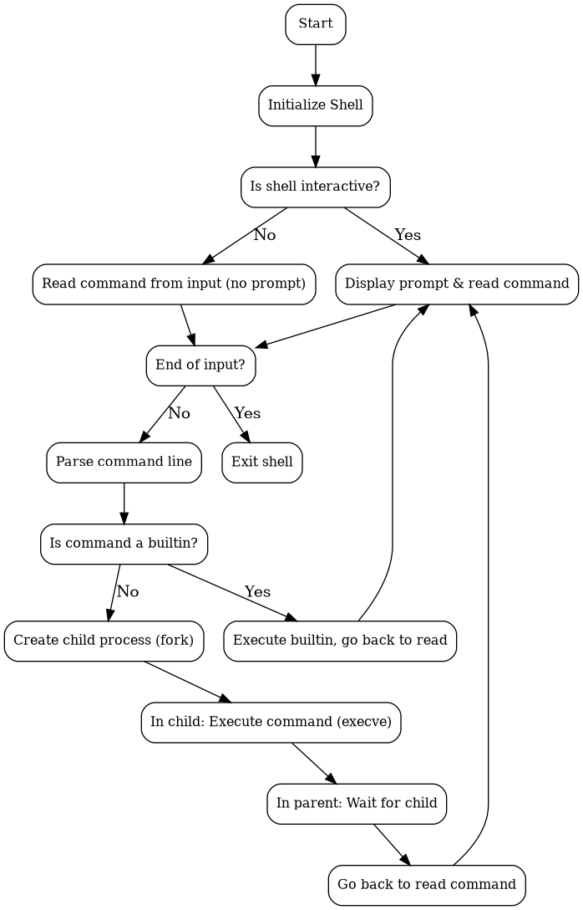

# holberton-simple_shell

## Description

**simple_shell** is a simplified shell Unix implementation. This project aims to comprehends how a shell works, including process handling,command execution and manipulation of environment variables

## Functionality
- Execution of system commands (ex : `ls`, `pwd`, `echo`, etc.)
- Handling command-line arguments
- Searching for executables in the PATH
- Handling the execution errors
- Signal handling (ex: Ctrl + C)
- Bult-ins : `exit`, `env`
- Interactive mode and non-interactive (batch) mode (ex: reading from a file or a pipe)

## Compilation

To compile the shell, use:
```sh
gcc -Wall -Werror -Wextra -pedantic *.c -o simple_shell
```

## Flowchart



## Usage

### Interactive mode
```sh
$ ./simple_shell
$ ls -l /tmp
$ echo "Hello, world!"
$ env
$ exit
```

### Batch mode
```sh
$ echo -e "ls\npwd" | ./simple_shell
```

## Builtins
- `exit` : Exit the shell
- `env` : Print the environment variables

## Project files
- `shell.c` : Main shell loop
- `exec_command.c` : Command execution logic
- `shell.h` : Main header file
- `test_shell.sh` : Testing script

## Example of execution
```sh
$ ./simple_shell
$ ls
exec_command.c  shell.c  shell.h  test_shell.sh
$ env
PATH=/usr/local/bin:/usr/bin:/bin
...
$ exit
```

## Authors
- Clément Gibot
- Arnaud Tilawat

## Licence
Copyright (c) 2025 Clément Gibot and Arnaud Tilawat. All rights reserved.

## Documentation
For more information, refer to the manual page:
```sh
man ./man_1_simple_shell
```
